# yolo+OpenCV目标检测 QQ飞车手游赛车及弯道识别

#### 介绍
   keras_yolov3+OpenCV目标检测，可识别QQ飞车手游内赛车和弯道，支持图片和视频的检测与输出。本视觉小白的初次尝试，经过种种困难后，终于训练出了自己标注的目标检测模型，实属不易，在此记录一下训练的整体步骤，还有很多不足，欢迎学习交流。

#### 环境配置
1.  系统：Windows11/10
2.  python3.7.8
3.  包（Package）
    Keras	2.2.4
    Pillow	5.1.0
    opencv-contrib-python	4.6.0.66
    numpy	1.21.6
    protobuf	3.20.1
    tensorboard	1.13.1
    tensorflow	1.13.1
    

#### 使用说明

- 成功啦！！！！
- 
- 过程回顾：
- 
- 整体代码结构：
- 
- 
- 打标很重要：labelimg 安装很简单，在terminal窗口pip install labelimg即可，装好后，直接输入labelimg就能启动
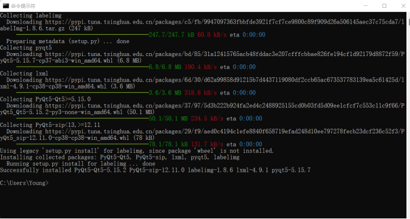
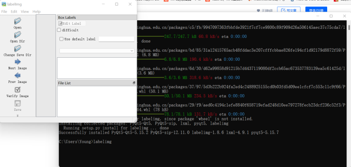
打标看看就会了：

- 数据集目录结构：
- 
- - 
- 如果是视频，也需打标，用下面这个程序可以转换为一张张图片：video_img_tool.py
- 

- 
- 打完标后，运行voc.py 在ImageSets/Main文件夹生成4个txt文件：
- 
- 
- 接着修改、运行voc_annotation.py

- 
- 修改classes为自己打标时所设置的标签
- 

- 运行完后生成这3个文件：
- 

- 到此，数据集就整理好了
- 
- 准备训练！！！
- 准备好权重文件yolov3.weights
- 先将其转为Keras适用的h5文件：python convert.py yolov3.cfg yolov3.weights model_data/yolo_weights.h5
- 注意：yolov3.cfg在这里先不用修改；h5文件名命名为yolo_weights.h5，因为后面的训练程序中要用到，默认为这个。
- 
- 接着voc_classes.txt 和 yolo_anchors.txt 的内容：

- 改成自己的标签名就行
- 
- yolo_anchors.txt 的值用kmeans.py可生成：
- yolo中anchor值的解释 | https://zhen8838.github.io/2019/03/12/yolo-anchor/#:~:text=yolo%E4%B8%ADanchor%E5%80%BC%E7%9A%84%E8%A7%A3%E9%87%8A anchor
- 

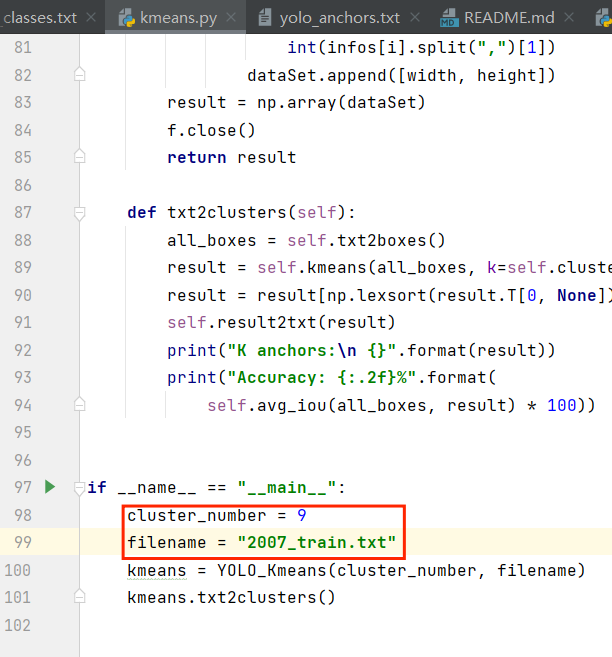
- k=9，对应生成yolo_anchors.txt；k=6，对应生成tiny_yolo_anchors.txt，这里cluster_number设置成9就行。同时运行窗口也会有打印输出，若没有写入文件，可参照原文件内容格式自行复制修改。
- 
- 好了，训练！！！
- 检查一下train.py 里要用到的文件是否配齐。
- log_dir是生成权重文件的路径，最终的成果就存在这里！
- 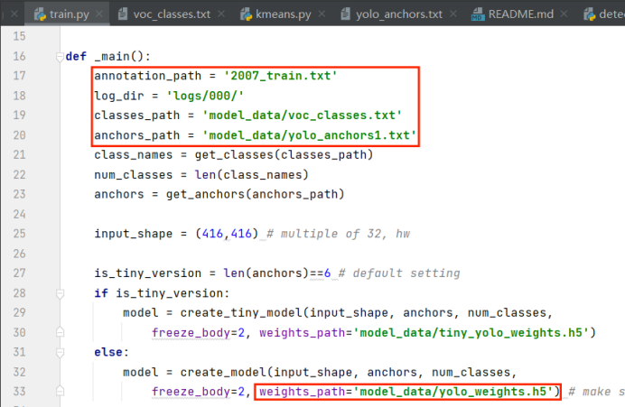
- 
- 运行train.py
- 也可以在pycharm里运行，在小黑窗运行感觉高级些[doge]
- 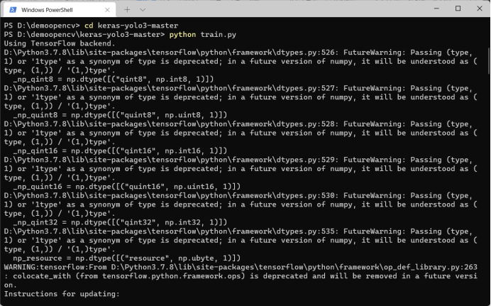
- 
- 训练中：
- 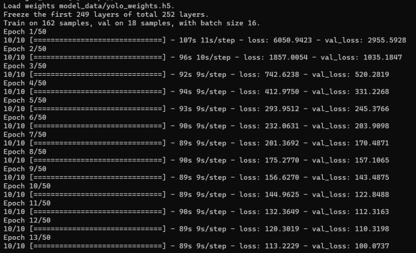
- 
- 训练有两个阶段，第二阶段最耗时间：
- 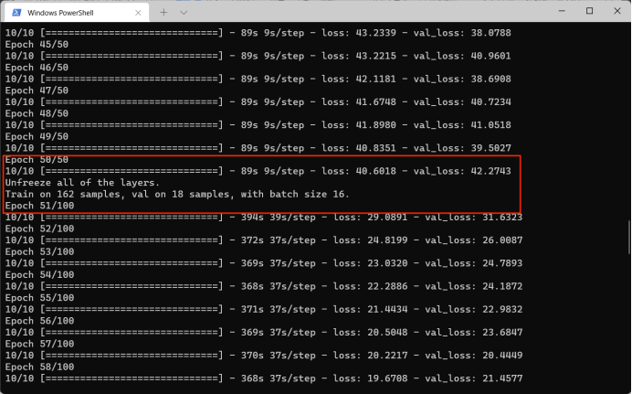
- 
- 训练完成啦！！！！！！
- 耗费7个小时，我的数据集只有200来张，电脑配置：小新AIR15 R7_4800U。
- 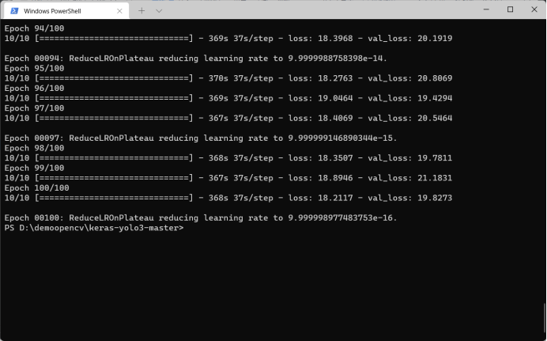
- 
- log/000文件夹里的trained_weights_final.h5文件就是我们要的。yeah！
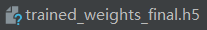
- 
- 测试一下看能不能用：
- 命令：python yolo_video.py --image
- 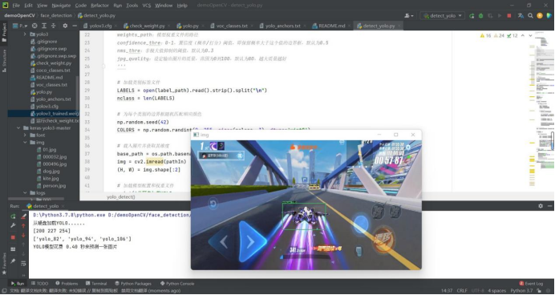
- 
- 好耶！！！ 功夫没白费
- 
- 官方的视频保存有问题，尝试过多次，但结果一直是文件损坏，没找到解决办法，所以用了其它的程序来写（利用OpenCV），但是又得把生成的trained_weights_final.h5权重文件转为weights格式：
- h5_weights转换:
- 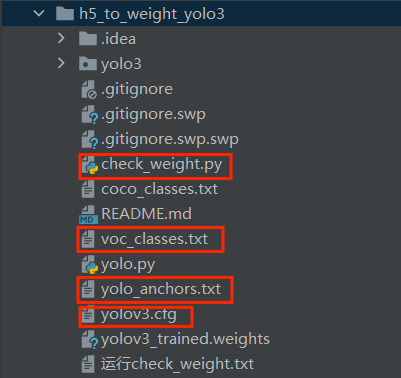
- 
- voc_classers.txt、yolo_anchors.txt的内容均修改为和训练时用到的对应文件内容相同，而yolov3.cfg还需修改的东西较多，为减少差错，用keras-yolo3-master的yolov3.cfg，复制过来后，修改3个yolo层的内容：
- 大概在607、693、780行。
- 修改filters、anchors、classes，
- filters=3*(classes+5)，我这里classes为2，即标签种类数为2，所以filters为21，anchors也是用训练时生成的值。3层都要同样地修改。
- 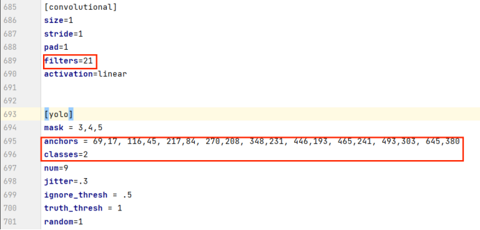
https://blog.csdn.net/weixin_45392081/article/details/106933516

- 
- 
- 程序主要是修改一下权重文件的路径
-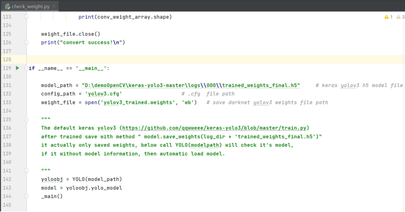 

- 
- 检查无误后，运行check_weight.py。OK，生成成功。
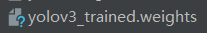
- 
- 使用：
- detection_yolo_video.py
- 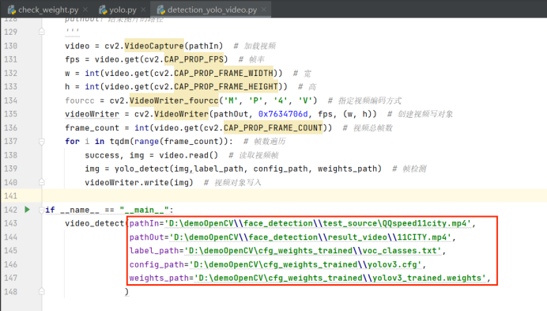
- pathIn为所要检测的视频路径，pathOut为检测结果输出路径，后3个均为上一步h5转weights时用到的，内容都一致，能对应上就行。
- 运行，等待检测完成。
- 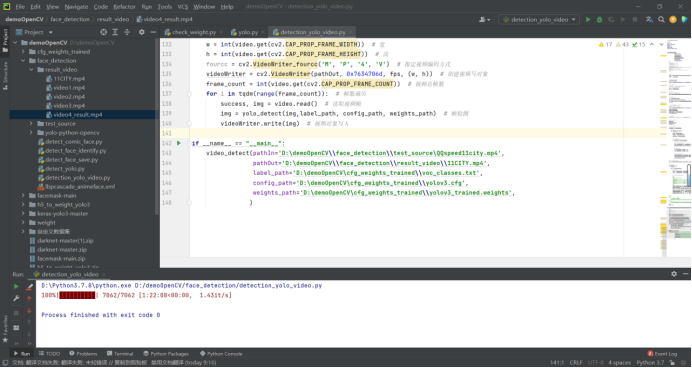
- 
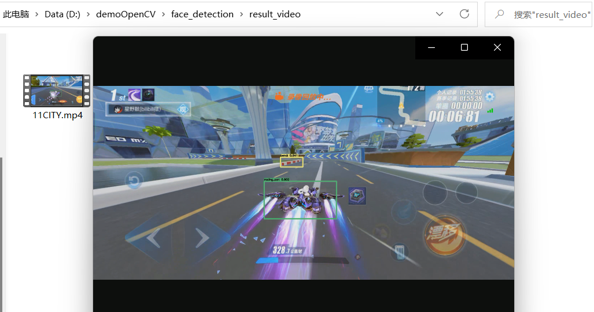
- 大功告成，非常nice！

#### 参与贡献

1.  Fork 本仓库
2.  新建 Feat_xxx 分支
3.  提交代码
4.  新建 Pull Request

#### 特技

1.  使用 Readme\_XXX.md 来支持不同的语言，例如 Readme\_en.md, Readme\_zh.md
2.  Gitee 官方博客 [blog.gitee.com](https://blog.gitee.com)
3.  你可以 [https://gitee.com/explore](https://gitee.com/explore) 这个地址来了解 Gitee 上的优秀开源项目
4.  [GVP](https://gitee.com/gvp) 全称是 Gitee 最有价值开源项目，是综合评定出的优秀开源项目
5.  Gitee 官方提供的使用手册 [https://gitee.com/help](https://gitee.com/help)
6.  Gitee 封面人物是一档用来展示 Gitee 会员风采的栏目 [https://gitee.com/gitee-stars/](https://gitee.com/gitee-stars/)
